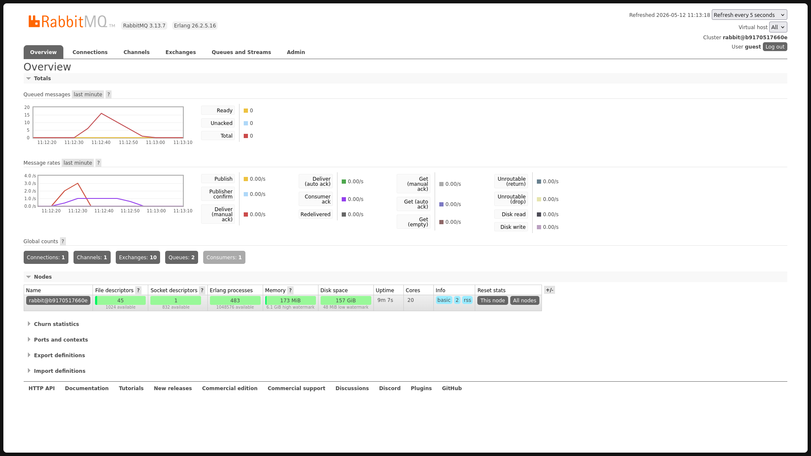

# Understanding Subscriber and Message Broker

**a. What is AMQP?**
AMQP (Advanced Message Queuing Protocol) adalah protokol standar terbuka di lapisan aplikasi (*application layer*) yang dirancang khusus untuk *message-oriented middleware*. Protokol ini beroperasi pada level *byte-stream* dan mendikte secara presisi bagaimana pesan dibungkus, dirutekan melalui *exchange*, diantrekan dalam *queue*, dan dikirimkan dengan jaminan koneksi (*reliability guarantees*) antar sistem yang saling terisolasi.

**b. Breakdown of `guest:guest@localhost:5672`**
URL ini adalah *Connection String* berbasis standar URI yang menstrukturkan parameter autentikasi dan *routing* TCP ke server RabbitMQ.
* **`guest` (pertama):** Kredensial *username default* sistem untuk otorisasi akses.
* **`guest` (kedua):** *Password default* yang divalidasi terhadap *username* tersebut.
* **`localhost`:** *Hostname* yang menunjuk ke *loopback interface* (127.0.0.1), menginstruksikan soket jaringan untuk mengeksekusi koneksi ke *broker* di mesin lokal.
* **`5672`:** *Port* TCP *default* tempat proses RabbitMQ melakukan *listening* untuk koneksi *inbound* berbasis AMQP.

PHOTO 1:

**Why the total number of queue is as such?**
Kuantitas akumulasi antrean merepresentasikan defisit antara beban trafik *publisher* dan *throughput* komputasi *subscriber*. Total 15 antrean mengindikasikan *publisher* dieksekusi 3 repetisi (3 *run* x 5 *event* = 15 *event*). Di sisi penerima, injeksi kode `thread::sleep(ten_millis)` memblokir *thread* pemrosesan sistem secara konstan selama 1 detik per eksekusi. RabbitMQ bertindak sebagai kompensator arsitektural dengan menahan (*buffering*) pesan tersebut di dalam *queue* untuk mencegah *data loss* atau *crash* akibat *subscriber* yang mengalami malfungsi kecepatan.